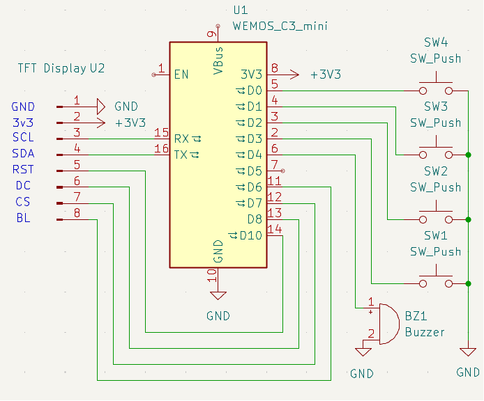
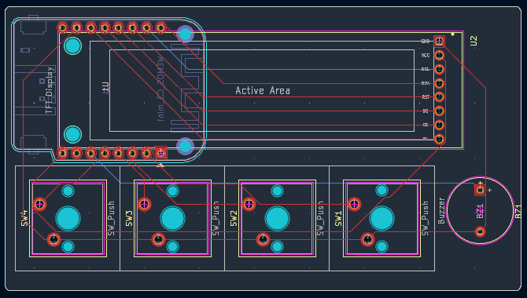

# Wind Waker Alarm

A waker/alarm to wake my sleepy up that also can act as a macropad, including a rechargable battery.

This repository contains folders for the following:
- Schematics: Designs for the wiring (pcb?)
- Case: CAD models of the alarm
- Firmware: Firmware for the alarm clock

Made for [blare](https://blare.hackclub.com)!

## Gallery

<!--  -->

## BOM
- 1x Lolin C3 Mini ESP 32
- 1x 2.25in TFT display
- 12x Keyboard Switches
- 1x 3.3V Piezo Buzzer
- Some Jumper Cables for wiring
- 1x Wemos Battery Shield
- 8x Stackable header pins

### Ideas:
- Reading music from USB?
- Time from a real RTC
- Real speaker module to play the music

## References
- [Guide](https://blare.hackclub.com)!
