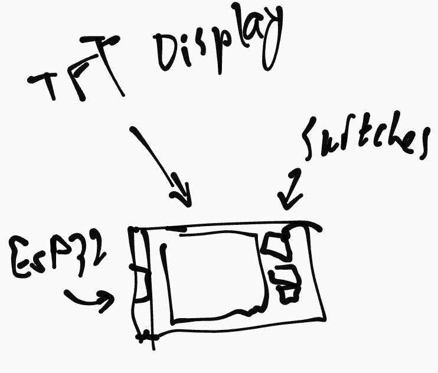

# Wind Waker Alarm
a waker/alarm to wake my sleepy up

Made for [blare](https://blare.hackclub.com)!

Folders for the following:
- Schematics: Designs for the wiring (pcb?)
- Case: CAD models of the alarm
- Firmware: Firmware for the alarm clock

## Gallery

## BOM
what will be in the kit
- Lolin C3 Mini ESP 32
- 2.25in TFT display
- 12 Keyboard Switches
- 3.3V Piezo Buzzer
- Some Jumper Cables for wiring

### Ideas:
- Reading music from USB?
- RTC?
- Real speaker for the music?

## References
- Guide!